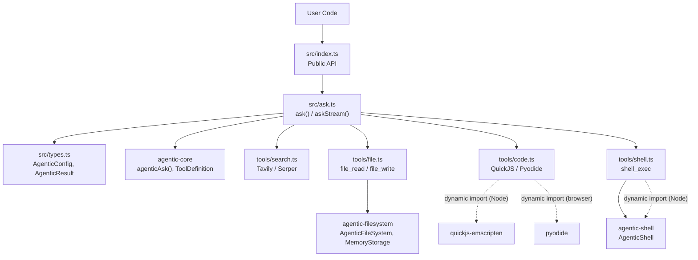

# Architecture

## Overview

agentic-lite is a thin integration layer that combines **agentic-core** (LLM agent loop + provider abstraction) with tool implementations (file, code, shell, search). It exposes two functions — `ask()` and `askStream()` — that run a multi-round tool-use loop until the model produces a final answer.

Design principle: ask.ts stays under 100 lines. All LLM logic lives in agentic-core; agentic-lite only wires tools and config.

## System Diagram



## Module Structure

### src/index.ts
Public API barrel. Re-exports `ask`, `askStream`, all types, and `AgenticFileSystem`/`MemoryStorage` from agentic-filesystem.

### src/ask.ts — Integration Layer
- `ask(prompt, config?): Promise<AgenticResult>` — runs agentic-core's `agenticAsk()` with `stream: false`, collects tool calls, returns structured result.
- `askStream(prompt, config?): AsyncGenerator<{ type, text? }>` — runs `agenticAsk()` with `stream: true` and an `emit` callback that pushes `{ type: 'text', text }` chunks through an async generator.
- `buildTools(config)` — assembles tool array based on `config.tools` (default: `['file', 'code']`). Shell is only registered when `isNodeEnv()` returns true.

### src/types.ts — Interfaces
- `AgenticConfig` — provider, apiKey, model, baseUrl, systemPrompt, tools, filesystem, toolConfig
- `AgenticResult` — answer, sources?, images?, codeResults?, files?, shellResults?, toolCalls?, usage
- `ToolName` — `'search' | 'code' | 'file' | 'shell'`
- `Source`, `CodeResult`, `FileResult`, `ShellResult`, `ToolCall`

### src/tools/

| Tool | File | Function | Runtime |
|---|---|---|---|
| file_read / file_write | file.ts | `executeFileRead()`, `executeFileWrite()` | Both |
| code_exec | code.ts | `executeCode()` | Both (QuickJS Node, AsyncFunction/Pyodide browser) |
| shell_exec | shell.ts | `executeShell()` | Node only (browser returns error) |
| web_search | search.ts | `executeSearch()` | Both (requires API key) |

## Data Flow

```
ask(prompt, config)
  ├─ Default filesystem: new AgenticFileSystem({ storage: new MemoryStorage() })
  ├─ buildTools(config) → tool array with execute wrappers
  ├─ Wrap each tool.execute to capture ToolCall[]
  └─ agenticAsk(prompt, {
       provider, apiKey, baseUrl, model,
       system: config.systemPrompt ?? OS_SYSTEM_PROMPT,
       tools: wrappedTools,
       stream: false
     })
     └─ agentic-core multi-round loop:
          LLM call → tool_use? → execute tools → append results → repeat
          stopReason !== 'tool_use' → return { answer, usage }

askStream(prompt, config)
  ├─ Same setup as ask()
  └─ agenticAsk(prompt, { ...config, stream: true }, emit)
     └─ emit('token', { text }) → pushed to async generator as { type: 'text', text }
```

## Provider Resolution

Provider selection and LLM communication are fully delegated to **agentic-core**. agentic-lite passes `provider`, `apiKey`, `baseUrl`, and `model` through to `agenticAsk()`.

### Custom Provider Fallback (in agentic-core)
When `provider='custom'`:
1. If `config.customProvider` is set → use it directly
2. Else if `config.baseUrl` is set → fall back to OpenAI-compatible adapter
3. Else → throw `Error('customProvider or baseUrl is required when provider="custom"')`

API key validation: agentic-core throws before any network call for `anthropic`/`openai` providers. Custom providers skip apiKey validation.

## Browser Compatibility

All Node-specific code uses dynamic `import()` behind environment guards:
- `quickjs-emscripten` — loaded only in Node for JS sandbox; browser falls back to `AsyncFunction` eval
- `pyodide` — loaded from CDN in browser; Node falls back to `python3` subprocess
- `agentic-shell` — loaded only when `isNodeEnv()` is true; browser gets descriptive error
- No static Node.js imports in any module

## Technology Stack

| Layer | Technology |
|---|---|
| Language | TypeScript (ESM) |
| Build | tsup |
| Test | vitest |
| Agent loop | agentic-core (zero-dependency) |
| File I/O | agentic-filesystem (MemoryStorage default) |
| Shell | agentic-shell (Node-only) |
| JS sandbox | quickjs-emscripten (Node) / AsyncFunction (browser) |
| Python sandbox | python3 subprocess (Node) / Pyodide CDN (browser) |
| Web search | Tavily API / Serper API |

## Design Principles

1. **Thin integration layer** — ask.ts < 100 lines; all LLM logic in agentic-core
2. **Browser-first** — no static Node dependencies; dynamic imports with guards
3. **Zero-config** — default MemoryStorage filesystem, default system prompt, default tools
4. **No heavy frameworks** — no chain/graph/memory abstractions
5. **Composable tools** — each tool is an independent module with its own `ToolDefinition` + `execute` function
