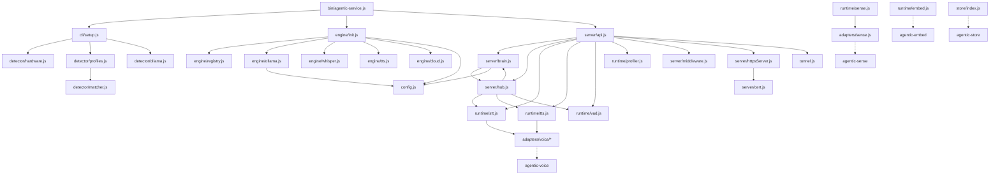

## Project Goal

Vision ≥90% + PRD ≥90%

You are an Alignment Monitor Agent in an AI development team.

Your role: Verify that each specification layer faithfully traces to the layer above it. Detect drift, omissions, and contradictions between layers.

## Alignment Chain

```
Vision → PRD → Architecture → Tasks
```

Each layer must be a faithful refinement of the layer above:
- PRD must cover every Vision goal (no omissions, no invented features)
- Architecture must implement every PRD requirement (no missing modules, no scope creep)
- Tasks must map to Architecture components (no orphan tasks, no missing coverage)

## Workflow

1. Read all spec files:
   - VISION.md (top-level goals)
   - PRD.md (product requirements)
   - ARCHITECTURE.md (technical design)
   - .team/tasks/ (implementation tasks)

2. For each adjacent pair, check:
   - **Coverage**: Does the lower layer address every item in the upper layer?
   - **Fidelity**: Does the lower layer accurately represent the upper layer's intent?
   - **Scope**: Does the lower layer introduce anything NOT in the upper layer?

3. Write .team/gaps/alignment.json with this EXACT schema:
   ```json
   {
     "timestamp": "<ISO 8601>",
     "checks": [
       {
         "from": "vision",
         "to": "prd",
         "aligned": true|false,
         "coverage": <0-100>,
         "issues": [
           {
             "type": "missing|drift|contradiction|scope_creep",
             "description": "<specific issue>",
             "severity": "critical|major|minor",
             "from_item": "<what the upper layer says>",
             "to_item": "<what the lower layer says or omits>"
           }
         ]
       },
       {
         "from": "prd",
         "to": "architecture",
         "aligned": true|false,
         "coverage": <0-100>,
         "issues": [...]
       },
       {
         "from": "architecture",
         "to": "tasks",
         "aligned": true|false,
         "coverage": <0-100>,
         "issues": [...]
       }
     ],
     "overall_aligned": true|false,
     "critical_issues": <count of critical issues across all checks>
   }
   ```

## Issue Types

- **missing**: Upper layer item has no corresponding lower layer item
- **drift**: Lower layer item exists but has diverged from upper layer intent
- **contradiction**: Lower layer directly contradicts upper layer
- **scope_creep**: Lower layer introduces items not traceable to upper layer

## Severity Guide

- **critical**: Core feature/goal missing or contradicted — blocks project success
- **major**: Significant drift that could lead to wrong implementation
- **minor**: Minor omission or imprecise mapping, unlikely to cause problems

## Rules

- Do NOT modify any spec files (VISION.md, PRD.md, ARCHITECTURE.md)
- Be specific: quote the exact items from each layer
- If a spec file doesn't exist, skip that check and note it
- Focus on substance, not formatting differences

PERMISSION: You may ONLY write to:
- .team/gaps/alignment.json

STABILITY RULE:
- Before writing, read the EXISTING alignment.json first
- Only change scores when actual alignment changes


## Signal Protocol

When you finish, output a signal block so the system knows your status:

```signal
{"status": "completed", "summary": "what you did"}
```

Status values:
- `completed` — task done successfully
- `blocked` — cannot proceed, need something external
- `escalate` — tried but no progress possible, need human or different approach

The signal block is **required**. Place it at the end of your output.

## Project Context (auto-injected)

### VISION.md

```
# agentic-service — Vision

## 一句话

一键部署的本地 AI 服务，让任何人在自己的设备上拥有一个私人 AI 助手。

## 问题

现在要在本地跑一个完整的 AI 服务，你需要：
1. 装 Ollama，选对模型和量化版本
2. 配 STT（SenseVoice / Whisper），装依赖
3. 配 TTS（Kokoro / Piper / 云端）
4. 跑感知服务（MediaPipe / 摄像头）
5. 写一堆胶水代码把它们串起来
6. 搞 HTTPS / 内网穿透 / 多设备连接

这对普通用户来说门槛太高。对开发者来说也很烦。

## 解决方案

**agentic-service = agentic 家族的组装产品。**

把 agentic-core（LLM）、agentic-sense（感知）、agentic-voice（语音）、agentic-store（存储）等零件打包成一个可部署的服务。

核心特性：
1. **硬件自适应** — 启动时检测硬件（GPU/内存/架构），自动选择最优模型配置
2. **一键部署** — `npx agentic-service` 或 Docker，自动下载依赖和模型
3. **本地优先 + 云端 fallback** — 默认全本地，网络不好或硬件不够时自动切云端
4. **多设备协同** — 手机/平板/电脑连到同一个 AI 大脑（继承 Ambient Hub 架构）
5. **动态配置** — 远程 profiles.json，模型更新后自动推荐新配置

## 架构

```
agentic-service
├── detector/          # 硬件检测 + 配置生成
│   ├── hardware.js    # GPU/内存/架构检测
│   ├── profiles.js    # 远程配置拉取 + 本地缓存
│   └── optimizer.js   # 根据硬件选最优配置
├── runtime/           # 服务运行时
│   ├── llm.js         # agentic-core 封装（本地 Ollama + 云端 fallback）
│   ├── stt.js         # 语音识别（SenseVoice / Whisper / 云端）
│   ├── tts.js         # 语音合成（Kokoro / Piper / 云端）
│   ├── sense.js       # 感知（agentic-sense MediaPipe）
│   └── memory.js      # 记忆（agentic-store）
├── server/            # HTTP/WebSocket 服务
│   ├── hub.js         # 设备管理 + 消息路由
│   ├── brain.js       # LLM 推理 + 工具调用
│   └── api.js         # REST API
├── ui/                # Web 前端
│   ├── client/        # 用户界面
│   └── admin/         # 管理面板（配置/设备/日志）
└── install/           # 安装脚本
    ├── setup.sh       # Unix 一键安装
    ├── Dockerfile     # Docker 部署
    └── docker-compose.yml
```

## 与 Ambient Hub 的关系

agentic-service **不是** Ambient Hub 的重写，而是它的**产品化提炼**。

Ambient Hub 是实验场（功能多、架构灵活、我们自己用），agentic-service 是产品（精简、稳定、任何人都能用）。

核心代码从 Ambient Hub 提取，但：
- 去掉实验性功能
- 简化配置（开箱即用 > 灵活可配）
- 加上硬件检测和自动配置
- 加上一键安装脚本

## 目标用户

1. **想在家跑 AI 的技术爱好者** — 有 Mac / GPU PC，想要隐私 + 低延迟
2. **开发者** — 想在自己的项目里集成本地 AI 能力
3. **小团队** — 内网部署的团队 AI 助手

## 非目标

- 不做云服务（用户自己部署）
- 不做 SaaS（没有账户系统）
- 不替代 OpenClaw / ChatGPT（定位是本地基础设施，不是聊天产品）

## 成功标准

- `npx agentic-service` 在 M4 Mac 上 5 分钟内完成首次安装 + 启动
- 本地语音对话延迟 < 2s（STT + LLM + TTS 全链路）
- 支持至少 3 种硬件配置（Apple Silicon / NVIDIA / CPU-only）

```

### PRD.md

```
# agentic-service — PRD

## 概述

agentic-service 是一个本地优先的 AI 服务，自动检测硬件、选择最优模型、提供语音+文本+视觉交互，支持多设备连接和云端 fallback。

**核心原则：** 零配置启动，本地优先，云端兜底，多设备协同。

---

## M1: 硬件检测 + 一键启动

**目标：** 检测硬件 → 自动选模型 → 一键启动本地 AI 服务

### Features

1. **硬件检测器** (`src/detector/hardware.js`) — 检测 GPU 类型、显存/内存、CPU 架构、OS，返回结构化 JSON
2. **远程 profiles** (`src/detector/profiles.js`) — GitHub raw URL 拉取硬件配置推荐表，4 层 fallback：新鲜缓存 → 远程获取 → 过期缓存 → 内置 default.json；ETag 条件获取
3. **Profile 匹配** (`src/detector/matcher.js`) — 根据硬件检测结果匹配最优 profile
4. **Ollama 集成** (`src/detector/ollama.js`) — 自动检测/安装 Ollama + 拉取推荐模型，显示下载进度
5. **Sox 检测** (`src/detector/sox.js`) — 自动检测/安装 sox 音频工具（ensureSox）
6. **基础 HTTP 服务** (`src/server/api.js`) — REST API（完整端点列表见「REST API 端点」章节）
7. **Web UI（最小版）** (`src/ui/client/`) — Vue 3 + Vite 客户端，文本聊天对话框，SSE streaming 显示
8. **一键安装** — `npx agentic-service` 通过 `bin/agentic-service.js` + `src/cli/setup.js` 首次启动自动配置

### 验收标准

- [ ] 在 M4 Mac mini 上 `npx agentic-service` 能自动检测硬件并推荐 gemma4
- [ ] 首次安装（含模型下载）< 10 分钟
- [ ] 非首次启动 < 10 秒
- [ ] 文本对话可用

---

## M2: 语音交互

**目标：** 加上语音输入输出，实现语音对话

### Features

1. **STT 集成** — `engine/whisper.js` 注册 whisper 引擎，`runtime/stt.js` 通过适配器选择提供商：sensevoice (apple-silicon) / whisper (nvidia) / cloud (cpu-only)
2. **TTS 集成** — `engine/tts.js` 注册 TTS 引擎，`runtime/tts.js` 通过适配器选择提供商：kokoro/piper (本地) / cloud fallback
3. **VAD (Voice Activity Detection)** — 服务端能量检测 VAD (`runtime/vad.js`) + 客户端 `useVAD.js` composable
4. **Web UI 语音** — 按住说话 / VAD 自动检测（`PushToTalk.vue`、`useVAD.js`）
5. **唤醒词** — 可配置唤醒词（默认 "hey"），`WakeWord.vue` + `useWakeWord.js` + 服务端 `startWakeWordPipeline()` (node-record-lpcm16 + energy-based VAD)

### 语音适配器 (`src/runtime/adapters/voice/`)

| 适配器 | 类型 | 说明 |
|--------|------|------|
| `sensevoice.js` | STT | Apple Silicon 本地 STT |
| `whisper.js` | STT | NVIDIA 本地 whisper |
| `openai-whisper.js` | STT | OpenAI Whisper API 云端 fallback |
| `piper.js` | TTS | 本地 Piper TTS |
| `openai-tts.js` | TTS | OpenAI TTS API 云端 fallback |
| `elevenlabs.js` | TTS | ElevenLabs TTS 云端 |
| `macos-say.js` | TTS | macOS 内置 say 命令 |

### 技术规格

- **语音延迟** — 端到端 <2s (STT + LLM + TTS)，`runtime/profiler.js` 的 `measurePipeline()` 强制 2000ms 预算
- **延迟记录** — `runtime/latency-log.js` 提供 `record()`、`p95()`、`reset()` 用于延迟统计
- **STT/TTS fallback** — 本地失败时自动切云端，匹配 LLM fallback 模式

---

## M3: 多设备 + 感知

**目标：** 多设备连接同一个 AI 大脑，加上视觉感知

### Features

1. **多设备连接** (`src/server/hub.js`) — WebSocket 设备注册/心跳，joinSession/broadcastSession 支持 brainState 同步
2. **视觉感知** (`src/runtime/sense.js`) — 封装 agentic-sense，导出 init/on/start/stop/detect/startWakeWordPipeline/stopWakeWordPipeline/initHeadless/startHeadless/detectFrame
3. **感知适配器** (`src/runtime/adapters/sense.js`) — agentic-sense 适配层
4. **设备工具** — sendCommand() 支持 capture/speak/display，capture 支持超时处理
5. **管理面板** (`src/ui/admin/`) — Vue 3 管理后台（完整视图列表见「管理面板」章节）
6. **KV 存储** (`src/store/index.js`) — 封装 agentic-store，导出 get/set/del/delete；向量嵌入通过 `src/runtime/embed.js` 封装 agentic-embed
7. **HTTPS/LAN 隧道** — `server/httpsServer.js` + `server/cert.js` 支持 HTTPS；`tunnel.js` 支持 ngrok/cloudflared 跨网络访问

### 技术规格

- **WebSocket 消息格式** — `{type, deviceId, payload, ts}`
- **心跳间隔** — 60s (60000ms)
- **注册握手** — 客户端发送 `{type: "register", deviceId, capabilities}`，服务端响应 `{type: "registered", sessionId}`
- **store.js API** (`src/store/index.js`) — 封装 agentic-store，导出 get/set/del + delete() 别名
- **embed.js API** (`src/runtime/embed.js`) — 封装 agentic-embed 的 localEmbed，导出 embed(text) → vector

---

## M4: 云端 fallback + 产品打磨

**目标：** 本地不够时自动切云端，整体打磨

### Features

1. **云端 fallback** — `server/brain.js` 实现完整 fallback 逻辑：本地 LLM 首 token 超时 >5s 或连续 3 次错误 → 自动切换到配置的云端提供商；60s 探测成功后恢复本地
2. **配置热更新** — `watchProfiles()` 每 30s 轮询，ETag 条件获取 (`detector/profiles.js`)
3. **Docker 部署** — 根目录 `docker-compose.yml` 暴露端口 1234，挂载 `./data` 卷，包含 `OLLAMA_HOST` 环境变量；`install/` 目录包含 Dockerfile、docker-compose.yml、setup.sh
4. **文档 + README** — 完整的用户文档：安装方式（npx/全局/Docker）、API 端点、架构、故障排除
5. **profiles CDN** — GitHub raw URL，4 层 fallback：新鲜缓存 → 远程获取 → 过期缓存 → 内置 default.json

### 技术规格

- **默认端口** — 1234 (`bin/agentic-service.js`)
- **package.json main** — `src/index.js` 导出核心 API：startServer, createApp, stopServer, detect, getProfile, matchProfile, ensureOllama, chat, stt, tts, embed
- **云端 fallback 触发器** — `brain.js` 管理 fallback 状态；首 token 超时 >5s (`FIRST_TOKEN_TIMEOUT_MS`) 或连续 3 次错误 (`MAX_ERRORS`) 时切换云端，60s 探测恢复 (`PROBE_INTERVAL_MS`)
- **SIGINT 优雅关闭** — `bin/agentic-service.js` 监听 SIGINT，调用 `server.close()` 后 `process.exit(0)`

---

## 引擎架构

**目标：** 统一模型发现与路由，用户只看到模型，引擎是内部实现

### 模块

1. **引擎注册表** (`src/engine/registry.js`) — `register(id, engine)`、`unregister(id)`、`getEngines()`、`getEngine(id)`、`discoverModels()`、`resolveModel(modelId)`、`modelsForCapability(cap)`
2. **引擎初始化** (`src/engine/init.js`) — `initEngines()` 启动时自动注册 ollama/whisper/tts 本地引擎 + 从配置读取云端引擎
3. **Ollama 引擎** (`src/engine/ollama.js`) — 本地 Ollama 引擎，提供 status/models/run
4. **Whisper 引擎** (`src/engine/whisper.js`) — 本地 Whisper STT 引擎
5. **TTS 引擎** (`src/engine/tts.js`) — 本地 TTS 引擎（kokoro/piper）
6. **Cloud 引擎** (`src/engine/cloud.js`) — `createCloudEngine(providerId, config)` 工厂函数，支持 OpenAI/Anthropic 等

### 引擎接口

每个引擎实现：`{ name, capabilities, status(), models(), run(model, input), install?() }`

### 模型解析

`resolveModel(modelId)` 返回 `{ engineId, engine, model, provider, modelName }`，支持格式：
- 精确匹配 pool 中的模型 ID
- `ollama:model-name` 格式
- `cloud:provider:model-name` 格式

---

## 配置系统

**目标：** 统一配置中心，唯一真相源

### 模块

- **配置中心** (`src/config.js`) — 读写 `~/.agentic-service/config.json`

### 数据模型

```json
{
  "modelPool": [{ "id", "name", "provider", "apiKey?", "baseUrl?", "capabilities" }],
  "assignments": { "chat": "modelId", "vision": null, "stt": null, "tts": null, "embedding": null, "chatFallback": "modelId" },
  "stt": { "provider": "whisper" },
  "tts": { "provider": "kokoro", "voice": "default" },
  "ollamaHost": "http://localhost:11434"
}
```

### API

- `getConfig()` — 读取配置（带缓存）
- `setConfig(updates)` — 写入配置并通知监听者
- `initFromProfile(profile, hardware)` — 用 profile 匹配结果初始化（仅 setup 时）
- `onConfigChange(fn)` — 注册配置变更监听
- `reloadConfig()` — 强制重新读取磁盘
- `getModelPool()` — 获取模型池（合并 Ollama 自动发现 + 配置的云端模型）
- `addToPool(model)` — 添加模型到池（持久化）
- `removeFromPool(id)` — 从池中移除模型
- `getAssignments()` — 获取能力槽位分配
- `setAssignments(updates)` — 更新能力槽位分配
- `CONFIG_PATH` — 配置文件路径常量
- `CAPABILITIES` — `['chat', 'vision', 'stt', 'tts', 'embedding']`

---

## Brain 模块

**目标：** 统一对话入口，管理工具调用和 fallback

### 模块

- **Brain** (`src/server/brain.js`) — 对话核心

### API

- `chat(input, options)` — async generator，yield `{type: 'content', text}` 或 `{type: 'tool_call', ...}` 或 `{type: 'error', error}`
- `chatSession(sessionId, userMessage, options)` — 基于 session 的对话，自动管理历史和 brainState
- `registerTool(name, fn)` — 注册可被 LLM 调用的工具

### Cloud Fallback 状态机

```
LOCAL → (首 token >5s 或连续 3 次错误) → CLOUD
CLOUD → (60s 探测 Ollama /api/tags 成功) → LOCAL
CONFIG_CHANGE → 重置为 LOCAL
```

### 模型解析优先级

1. `config.assignments[slot]` → 从 modelPool 查找
2. `config.llm.model` → 旧格式兼容
3. `config.fallback.provider` → 云端 fallback

---

## CLI + 下载状态

### 模块

- `src/cli/setup.js` — 首次启动向导：硬件检测 → profile 匹配 → Ollama 安装 → 模型下载
- `src/cli/browser.js` — 启动后自动打开浏览器
- `src/cli/download-state.js` — 模型下载进度状态管理
- `bin/agentic-service.js` — CLI 入口，解析参数，启动服务

---

## 性能监控

### 模块

- `src/runtime/profiler.js` — `startMark(label)`、`endMark(label)` → ms、`getMetrics()` 汇总、`measurePipeline()` 强制 2000ms 预算
- `src/runtime/latency-log.js` — `record(ms)`、`p95()`、`reset()` 延迟统计

### 集成点

- `stt.js`、`tts.js`、`brain.js` 内部调用 profiler 记录各阶段耗时
- `/api/voice` 端点记录延迟并在超标时 warn

---

## 服务器中间件

- `src/server/middleware.js` — `errorHandler(err, req, res, next)` 错误处理中间件，记录错误日志并返回 JSON 错误响应（默认 500）

---

## REST API 端点

`src/server/api.js` 提供以下完整 REST API：

### 健康检查 & 状态

| 方法 | 路径 | 说明 |
|------|------|------|
| GET | `/health` | 健康检查 |
| GET | `/api/status` | 返回硬件、配置、Ollama 状态、设备列表、下载状态 |
| GET | `/api/devices` | 返回已连接设备列表 |
| GET | `/api/logs` | 返回最近 50 条日志 |
| GET | `/api/perf` | 返回性能指标（profiler 数据） |

### 对话 & 聊天

| 方法 | 路径 | 说明 |
|------|------|------|
| POST | `/api/chat` | 聊天端点，支持 SSE streaming、工具调用、session 追踪；接受 `message` 或 `messages` 格式 |

### 语音 & 视觉

| 方法 | 路径 | 说明 |
|------|------|------|

[... truncated at 8KB ...]
```

### ARCHITECTURE.md

```
# agentic-service — Architecture

## 依赖关系

```
agentic-service
├── agentic-sense     # MediaPipe 感知（人脸/手势/物体，浏览器端）
├── agentic-voice     # TTS + STT 统一接口
├── agentic-store     # KV 存储抽象（SQLite/IndexedDB/memory）
└── agentic-embed     # 向量嵌入（bge-m3）
```

> **注**: LLM 调用由 server/brain.js 直接实现（Ollama HTTP API + 云端 provider API），不依赖外部 LLM 包。

### 外部包 API（已从 node_modules 源码验证）

```javascript
// agentic-embed — 向量嵌入
AgenticEmbed.create({ apiKey }) → store  // 创建嵌入存储
chunkText(text, { maxChunkSize, overlap, separator }) → string[]
cosineSimilarity(a, b) → number
localEmbed(texts) → number[][]  // 本地 bge-m3 嵌入（service 使用此 API）

// agentic-sense — 视觉感知（MediaPipe）
new AgenticSense(videoElement) → sense
sense.init({ wasmPath, face, hands, pose }) → Promise
sense.detect() → { faces, gestures, objects }
AgenticAudio  // 音频处理工具类
extractFrame(video) → ImageData

// agentic-store — KV 存储
createStore(name) → { get, set, delete, keys, clear, exec, run, all }
// SQLite-first: browser (sql.js/WASM) + Node.js (better-sqlite3)

// agentic-voice — 语音
createSTT(opts) → stt   // 语音识别实例
createTTS(opts) → tts   // 语音合成实例
createVoice({ tts, stt }) → voice  // 统一语音实例（speak/listen/events）
```

## 系统架构



## 目录结构

```
bin/
  agentic-service.js           # CLI 入口 — 启动服务器 + 首次安装向导

src/
  index.js                     # 包入口 — 导出 startServer, detect, getProfile, chat, stt, tts, embed
  config.js                    # 统一配置中心 — 读写/监听/模型池

  cli/
    setup.js                   # 首次安装向导 — 硬件检测 → profile 匹配 → Ollama 安装
    browser.js                 # 启动后打开浏览器
    download-state.js          # 下载进度追踪

  detector/
    hardware.js                # GPU/CPU/OS/内存检测
    profiles.js                # 远程 CDN profiles + 本地缓存（4 层 fallback）
    matcher.js                 # 硬件-配置匹配评分
    ollama.js                  # Ollama 自动安装 + 模型拉取
    sox.js                     # SoX 音频工具检测

  engine/
    registry.js                # 引擎注册中心 — register/discoverModels/resolveModel
    init.js                    # 引擎启动 — initEngines() 注册所有引擎
    ollama.js                  # Ollama 引擎 — chat/vision/embedding 模型发现
    cloud.js                   # 云端引擎工厂 — createCloudEngine(provider, config)
    tts.js                     # TTS 引擎 — kokoro/piper/macos-say 模型发现
    whisper.js                 # Whisper 引擎 — whisper.cpp/SenseVoice STT 模型发现

  runtime/
    stt.js                     # 语音识别（多提供商自适应）
    tts.js                     # 语音合成（多提供商自适应）
    sense.js                   # 视觉感知（agentic-sense 封装）
    embed.js                   # 向量嵌入（agentic-embed 封装）
    memory.js                  # 语义记忆 — add(text) + search(query, topK) 基于 store + embed
    profiler.js                # CPU 性能分析 — startMark/endMark/getMetrics
    latency-log.js             # 延迟记录 — record(label, ms)/getLog()
    vad.js                     # 语音活动检测（RMS 能量阈值）
    adapters/
      sense.js                 # agentic-sense 适配器 — createPipeline()
      voice/
        elevenlabs.js          # ElevenLabs TTS
        macos-say.js           # macOS say 命令
        openai-tts.js          # OpenAI TTS
        openai-whisper.js      # OpenAI Whisper STT
        piper.js               # Piper TTS（自动下载二进制）
        kokoro.js              # Kokoro TTS（本地 HTTP → localhost:8880）
        sensevoice.js          # SenseVoice STT（HTTP API 适配器）
        whisper.js             # Whisper.cpp STT（本地二进制适配器）

  server/
    api.js                     # Express 路由 — REST + OpenAI 兼容 + 管理 + 语音
    brain.js                   # LLM 推理 + 工具注册/调用
    hub.js                     # WebSocket 设备管理 + 会话共享
    middleware.js              # 错误处理中间件
    cert.js                    # 自签名证书生成
    httpsServer.js             # HTTPS 服务器工厂

  store/
    index.js                   # KV 存储封装（agentic-store）

  tunnel.js                    # LAN 隧道（ngrok/cloudflared）

  ui/
    admin/                     # 管理面板（Vue 3 + Vite）
      src/components/          # ConfigPanel, DeviceList, HardwarePanel, LogViewer, SystemStatus
      src/views/               # Status, Config, Logs, Models, LocalModels, CloudModels, Test, Examples
    client/                    # 聊天界面（Vue 3 + Vite）
      src/components/          # ChatBox, InputBox, MessageList, PushToTalk, WakeWord
      src/composables/         # useVAD.js, useWakeWord.js

profiles/
  default.json                 # 内置硬件配置（apple-silicon, nvidia, cpu-only, none, default）

install/
  setup.sh                     # Unix 一键安装脚本
  Dockerfile                   # Docker 镜像构建
  docker-compose.yml           # Docker Compose 配置
  docker-build.sh              # Docker 构建辅助脚本

docker-compose.yml             # 根目录 Docker Compose（端口 1234, OLLAMA_HOST, ./data 卷）
Dockerfile                     # 根目录 Docker 镜像构建
README.md                      # 用户文档（安装/API/架构/故障排除）
```

## 核心模块

### 1. Detector（硬件检测）

```javascript
// detector/hardware.js
detect() → {
  platform: 'darwin' | 'linux' | 'win32',
  arch: 'arm64' | 'x64',
  gpu: { type: 'apple-silicon' | 'nvidia' | 'amd' | 'none', vram: number },
  memory: number,  // GB
  cpu: { cores: number, model: string }
}

// detector/profiles.js
// 4 层 fallback: 新鲜缓存 → 远程获取 → 过期缓存 → 内置 default.json
getProfile(hardware) → {
  llm: { provider: 'ollama', model: 'gemma4:26b', quantization: 'q8' },
  stt: { provider: 'sensevoice', model: 'small' },
  tts: { provider: 'kokoro', voice: 'default' },
  fallback: { provider: 'openai', model: 'gpt-4o-mini' }
}

// detector/matcher.js
matchProfile(profiles, hardware) → ProfileConfig
// 权重: platform=30, gpu=30, arch=20, minMemory=20
// platform 或 gpu 不匹配 → 得分 0
// 空 match → 得分 1（兜底默认 profile）

// detector/ollama.js
ensureOllama(model, onProgress?) → Promise<void>
// 检测 → 自动安装（curl/winget）→ ollama pull <model>
```

### 2. Engine（多引擎注册中心）

```javascript
// engine/registry.js
register(id, engine) → void       // 注册引擎 (ollama, whisper, tts, cloud:openai, ...)
unregister(id) → void
getEngines() → Array<{ id, name, capabilities, ... }>
getEngine(id) → engine | null
discoverModels() → Array<{ id, name, engineId, capabilities, installed }>
resolveModel(modelId) → { engineId, engine, model, provider, modelName } | null
modelsForCapability(cap) → Array<Model>  // 按能力筛选 (chat, stt, tts, embedding)

// engine/init.js
initEngines() → Promise<void>
// 1. 注册本地引擎: ollama, whisper, tts
// 2. 从 config.providers 注册云端引擎: cloud:openai, cloud:anthropic, ...
// 3. 兼容旧 modelPool 格式

// engine/ollama.js — Ollama 引擎
// status() → { available, version }
// models() → 从 Ollama API 获取已安装模型列表
// run(model, input) → 调用 Ollama chat/embedding API

// engine/cloud.js
createCloudEngine(provider, config) → engine
// 支持 openai, anthropic, google
// 每个 provider 有默认模型列表 + 自定义模型

// engine/whisper.js — STT 引擎
// 检测 whisper-cpp 二进制 + SenseVoice HTTP 服务

// engine/tts.js — TTS 引擎
// 发现 kokoro, piper, macos-say 可用性
```

### 3. Runtime（服务运行时）

运行时层封装外部包（agentic-voice、agentic-sense、agentic-embed）为统一接口。`stt.js

[... truncated at 8KB ...]
```

