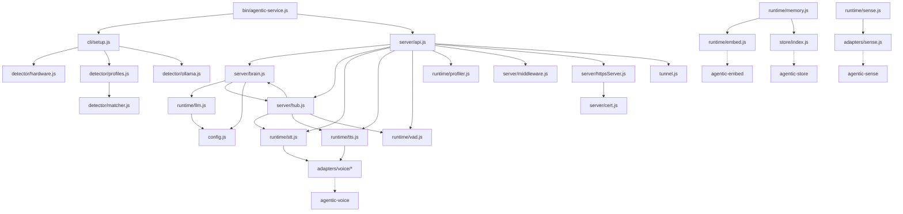

# agentic-service — Architecture

## 依赖关系

```
agentic-service
├── agentic-core      # LLM 调用引擎（streaming, tool use, retry）
├── agentic-sense     # MediaPipe 感知（人脸/手势/物体，浏览器端）
├── agentic-voice     # TTS + STT 统一接口
├── agentic-store     # KV 存储抽象（SQLite/IndexedDB/memory）
└── agentic-embed     # 向量嵌入（bge-m3）
```

## 系统架构



## 目录结构

```
bin/
  agentic-service.js           # CLI 入口 — 启动服务器 + 首次安装向导

src/
  config.js                    # 统一配置中心 — 读写/监听/模型池

  cli/
    setup.js                   # 首次安装向导 — 硬件检测 → profile 匹配 → Ollama 安装
    browser.js                 # 启动后打开浏览器
    download-state.js          # 下载进度追踪

  detector/
    hardware.js                # GPU/CPU/OS/内存检测
    profiles.js                # 远程 CDN profiles + 本地缓存（4 层 fallback）
    matcher.js                 # 硬件-配置匹配评分
    optimizer.js               # 硬件自适应优化参数
    ollama.js                  # Ollama 自动安装 + 模型拉取
    sox.js                     # SoX 音频工具检测

  runtime/
    llm.js                     # LLM 聊天流式输出（Ollama 优先 → 云端 fallback）
    stt.js                     # 语音识别（多提供商自适应）
    tts.js                     # 语音合成（多提供商自适应）
    sense.js                   # 视觉感知（agentic-sense 封装）
    memory.js                  # 向量记忆（嵌入 + KV 存储）
    embed.js                   # 向量嵌入（agentic-embed 封装）
    profiler.js                # CPU 性能分析 — startMark/endMark/getMetrics
    latency-log.js             # 延迟记录 — record(label, ms)/getLog()
    vad.js                     # 语音活动检测（RMS 能量阈值）
    adapters/
      embed.js                 # 嵌入适配器（stub）
      sense.js                 # agentic-sense 适配器 — createPipeline()
      voice/
        elevenlabs.js          # ElevenLabs TTS
        macos-say.js           # macOS say 命令
        openai-tts.js          # OpenAI TTS
        openai-whisper.js      # OpenAI Whisper STT
        piper.js               # Piper TTS（自动下载二进制）

  server/
    api.js                     # Express 路由 — REST + OpenAI 兼容 + 管理 + 语音
    brain.js                   # LLM 推理 + 工具注册/调用
    hub.js                     # WebSocket 设备管理 + 会话共享
    middleware.js              # 错误处理中间件
    cert.js                    # 自签名证书生成
    httpsServer.js             # HTTPS 服务器工厂

  store/
    index.js                   # KV 存储封装（agentic-store）

  tunnel.js                    # LAN 隧道（ngrok/cloudflared）

  ui/
    admin/                     # 管理面板（Vue 3 + Vite）
      src/components/          # ConfigPanel, DeviceList, HardwarePanel, LogViewer, SystemStatus
      src/views/               # Dashboard, Config, Logs, Models, Status, Test, Examples
    client/                    # 聊天界面（Vue 3 + Vite）
      src/components/          # ChatBox, InputBox, MessageList, PushToTalk, WakeWord
      src/composables/         # useVAD.js, useWakeWord.js

profiles/
  default.json                 # 内置硬件配置（apple-silicon, nvidia, cpu-only, none, default）

install/
  setup.sh                     # Unix 一键安装脚本
  Dockerfile                   # Docker 镜像构建
  docker-compose.yml           # Docker Compose 配置
  docker-build.sh              # Docker 构建辅助脚本

docker-compose.yml             # 根目录 Docker Compose
```

## 核心模块

### 1. Detector（硬件检测）

```javascript
// detector/hardware.js
detect() → {
  platform: 'darwin' | 'linux' | 'win32',
  arch: 'arm64' | 'x64',
  gpu: { type: 'apple-silicon' | 'nvidia' | 'amd' | 'none', vram: number },
  memory: number,  // GB
  cpu: { cores: number, model: string }
}

// detector/profiles.js
// 4 层 fallback: 新鲜缓存 → 远程获取 → 过期缓存 → 内置 default.json
getProfile(hardware) → {
  llm: { provider: 'ollama', model: 'gemma4:26b', quantization: 'q8' },
  stt: { provider: 'sensevoice', model: 'small' },
  tts: { provider: 'kokoro', voice: 'default' },
  fallback: { provider: 'openai', model: 'gpt-4o-mini' }
}

// detector/matcher.js
matchProfile(profiles, hardware) → ProfileConfig
// 权重: platform=30, gpu=30, arch=20, minMemory=20
// platform 或 gpu 不匹配 → 得分 0
// 空 match → 得分 1（兜底默认 profile）

// detector/optimizer.js
optimize(hardware) → { threads, memoryLimit, model, quantization }
// apple-silicon: 8 threads, 75% memory, gemma4:26b q8
// nvidia: 4 threads, 80% vram, gemma4:13b q4
// cpu-only: cores threads, 50% memory, gemma2:2b q4

// detector/ollama.js
ensureOllama(model, onProgress?) → Promise<void>
// 检测 → 自动安装（curl/winget）→ ollama pull <model>
```

### 2. Runtime（服务运行时）

```javascript
// runtime/llm.js
chat(messageOrText, options?) → AsyncGenerator<{ type, content, done }>
// Ollama 优先 → 失败时 fallback 到 config.fallback.provider (openai/anthropic)
// 内部: chatWithOllama(), chatWithAnthropic(), chatWithOpenAI()
// 集成 profiler startMark/endMark + latency-log record()

// runtime/stt.js
init(config) → void           // 根据 config.stt.provider 选择适配器
transcribe(audioBuffer) → text

// runtime/tts.js
init(config) → void           // 根据 config.tts.provider 选择适配器
synthesize(text) → audioBuffer

// runtime/sense.js
detect(frame) → { faces, gestures, objects }
start() / stop()              // 事件循环模式
startHeadless() → EventEmitter // 服务端无头模式

// runtime/memory.js
add(text) → Promise<void>     // 嵌入 + 存储，key="mem:<ts>:<random>"
search(query, topK?=5) → Promise<Array<{ text, score }>>
remove(key) → Promise<void>   // 别名 delete()
// 使用 promise 锁保证写操作串行

// runtime/embed.js
embed(text) → number[]        // 委托 agentic-embed

// runtime/profiler.js
startMark(label) → void
endMark(label) → void
getMetrics() → Map<label, { count, total, avg, min, max }>

// runtime/latency-log.js
record(label, ms) → void
getLog() → Array<{ label, ms, ts }>

// runtime/vad.js
detectVoiceActivity(buffer) → boolean  // RMS 能量阈值检测（Int16 PCM）
```

### 3. Server（HTTP/WebSocket）

```javascript
// server/api.js
createApp() → { app, server }
// REST 端点:
//   GET  /health
//   GET  /v1/models              (OpenAI 兼容)
//   POST /v1/chat/completions    (OpenAI 兼容)
//   POST /api/chat               (流式聊天)
//   POST /api/transcribe         (STT)
//   POST /api/synthesize         (TTS)
//   POST /api/voice              (STT → LLM → TTS 全链路)
//   GET  /api/status             (设备 + Ollama 状态)
//   GET  /api/config             (读取配置)
//   PUT  /api/config             (更新配置)
//   GET  /api/logs               (日志缓冲)
//   GET  /api/perf               (性能指标)
//   GET  /api/models/pool        (模型池)
//   POST /api/models/pool        (添加模型)
//   DELETE /api/models/pool/:id  (删除模型)
//   GET  /api/models/assignments (能力分配)
//   PUT  /api/models/assignments (更新分配)
// 静态文件: /admin → dist/admin
// SIGINT 优雅关闭: startDrain() + waitDrain(timeout)

// server/brain.js
chat(messages, options?) → AsyncGenerator<{ type, content, done }>
// 解析模型池分配 → 选择 provider → 流式推理
// 支持 tool_use: registerTool(name, fn), 自动执行工具调用
registerTool(name, fn) → void

// server/hub.js
init() → Promise<void>
initWebSocket(server) → void
joinSession(sessionId, deviceId) → { sessionId, history, brainState, deviceCount }
broadcastSession(sessionId, message?) → void
setSessionData(sessionId, key, value) → void
getSessionData(sessionId, key) → any
getSession(sessionId) → Session | null
getDevices() → Array<{ id, name, capabilities, lastPong }>
sendCommand(deviceId, command) → Promise<response>
startWakeWordDetection() → void
broadcastWakeword() → void
// WebSocket 消息: register/registered/ping/pong/chat/voice/wakeword
// 心跳超时: 60s (60000ms)
// 设备注册: { type: "register", deviceId, capabilities }

// server/middleware.js
errorHandler(err, req, res, next) → void  // Express 错误处理

// server/cert.js
generateCert() → { key, cert }  // selfsigned 自签名证书

// server/httpsServer.js
createHttpsServer(app, options?) → https.Server
```

### 4. Store（数据持久化）

```javascript
// store/index.js — 封装 agentic-store
get(key) → Promise<any>
set(key, value) → Promise<void>
del(key) → Promise<void>
delete(key) → Promise<void>   // del() 的别名
list(prefix?) → Promise<string[]>
```

### 5. Tunnel（LAN 隧道）

```javascript
// tunnel.js
startTunnel(port) → void
// 优先 ngrok，其次 cloudflared
// 未安装则退出
// SIGINT 时自动终止子进程
```

### 6. CLI（命令行工具）

```javascript
// cli/setup.js
runSetup() → Promise<void>
// 首次安装向导: 硬件检测 → profile 匹配 → Ollama 安装 → 模型拉取

// cli/browser.js
openBrowser(port) → void
// 启动后自动打开浏览器
```

### 7. Config（配置中心）

```javascript
// config.js
getConfig() → Promise<Config>
setConfig(updates) → Promise<void>
onConfigChange(fn) → void
reloadConfig() → Promise<Config>
getModelPool() → Promise<Array<ModelEntry>>
addToPool(entry) → Promise<void>
removeFromPool(id) → Promise<void>
getAssignments() → Promise<Record<slot, modelId>>
setAssignments(assignments) → Promise<void>
// 配置路径: ~/.agentic-service/config.json
// 能力槽: chat, code, vision, embedding, stt, tts
```

### 8. VAD + 唤醒词

```javascript
// runtime/vad.js
detectVoiceActivity(buffer) → boolean
// RMS 能量阈值检测，Int16 PCM 输入

// hub.js 内置
isSilent(buffer) → boolean    // Float32 RMS < 0.01
startWakeWordDetection()      // 服务端唤醒词管道

// ui/client/composables/useVAD.js — 客户端 VAD
// ui/client/composables/useWakeWord.js — 客户端唤醒词
// ui/client/components/PushToTalk.vue — 按住说话
// ui/client/components/WakeWord.vue — 唤醒词 UI
```

### 9. agentic-embed（向量嵌入）

```javascript
// runtime/embed.js — 封装 agentic-embed 包
embed(text) → number[]  // bge-m3 向量嵌入
// TypeError if text is not a string
// 空字符串返回空数组
// 被 memory.js 用于语义搜索
```

## 数据流

### 文本聊天

```
Client → POST /api/chat → api.js → brain.chat()
  → resolveModel(slot='chat') → config.assignments → model pool
  → llm.chat(messages) → Ollama streaming → yield chunks
  → (Ollama 失败) → cloud fallback (OpenAI/Anthropic)
  → SSE stream → Client
```

### 语音对话

```
Client → POST /api/voice (audio file)
  → stt.transcribe(buffer) → text
  → brain.chat([{role:'user', content:text}]) → LLM response
  → tts.synthesize(response) → audio buffer
  → Response (audio + text + latency)
  延迟预算: <2000ms (profiler.js 强制)
```

### 设备注册

```
Device → WebSocket connect → hub.js
  → { type: "register", deviceId, capabilities }
  → registry.set(deviceId, { ws, name, capabilities, lastPong })
  → { type: "registered", sessionId }
  → 心跳: ping/pong 每 60s
  → 超时: 60s 无 pong → 移除设备
```

### 硬件检测 + 配置

```
npx agentic-service → setup.js
  → hardware.detect() → { platform, arch, gpu, memory, cpu }
  → profiles.getProfile(hardware)
    → 缓存 → CDN → 过期缓存 → default.json
    → matcher.matchProfile(profiles, hardware)
  → ollama.ensureOllama(profile.llm.model)
  → config.setConfig(profile)
  → 启动服务器
```

## 安装方式

```bash
# npx 一键启动
npx agentic-service

# 全局安装
npm install -g agentic-service
agentic-service

# Docker
docker-compose up
# 注意: 默认端口 1234，Docker Compose 需配置正确端口映射
```

## 设计原则

1. **本地优先** — 默认全本地运行，云端仅作 fallback
2. **硬件自适应** — 启动时检测硬件，自动选择最优模型配置
3. **零配置** — 开箱即用，首次运行自动完成所有设置
4. **模块化** — 每个能力独立模块，统一接口，可替换适配器
5. **流式优先** — LLM/STT/TTS 全部支持流式处理，降低感知延迟
