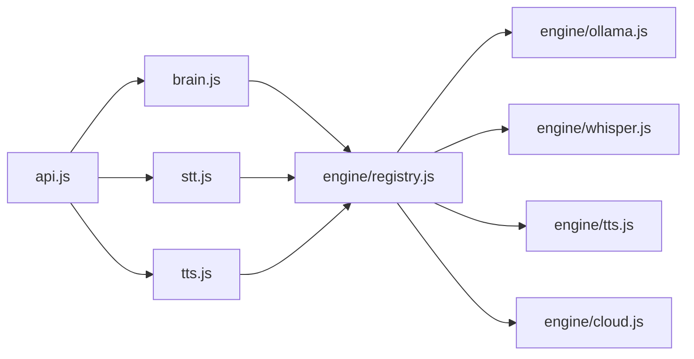
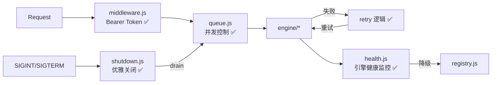

# agentic-service — Architecture

## 依赖关系

```
agentic-service
├── agentic-sense     # MediaPipe 感知（人脸/手势/物体，浏览器端）
├── agentic-voice     # TTS + STT 统一接口
├── agentic-store     # KV 存储抽象（SQLite/IndexedDB/memory）
└── agentic-embed     # 向量嵌入（bge-m3）
```

> **注**: LLM 调用由 server/brain.js 直接实现（Ollama HTTP API + 云端 provider API），不依赖外部 LLM 包。

### 外部包 API（已从 node_modules 源码验证）

```javascript
// agentic-embed — 向量嵌入
AgenticEmbed.create({ apiKey }) → store  // 创建嵌入存储
chunkText(text, { maxChunkSize, overlap, separator }) → string[]
cosineSimilarity(a, b) → number
localEmbed(texts) → number[][]  // 本地 bge-m3 嵌入（service 使用此 API）

// agentic-sense — 视觉感知（MediaPipe）
new AgenticSense(videoElement) → sense
sense.init({ wasmPath, face, hands, pose }) → Promise
sense.detect() → { faces, gestures, objects }
AgenticAudio  // 音频处理工具类
extractFrame(video) → ImageData

// agentic-store — KV 存储
createStore(name) → { get, set, delete, keys, clear, exec, run, all }
// SQLite-first: browser (sql.js/WASM) + Node.js (better-sqlite3)

// agentic-voice — 语音
createSTT(opts) → stt   // 语音识别实例
createTTS(opts) → tts   // 语音合成实例
createVoice({ tts, stt }) → voice  // 统一语音实例（speak/listen/events）
```

## 系统架构

```mermaid
graph TD
    CLI[bin/agentic-service.js] --> Setup[cli/setup.js]
    CLI --> EngInit[engine/init.js]
    CLI --> API[server/api.js]

    Setup --> HW[detector/hardware.js]
    Setup --> Prof[detector/profiles.js]
    Setup --> OllamaDet[detector/ollama.js]
    Prof --> Matcher[detector/matcher.js]

    EngInit --> Registry[engine/registry.js]
    EngInit --> OllamaEng[engine/ollama.js]
    EngInit --> WhisperEng[engine/whisper.js]
    EngInit --> TTSEng[engine/tts.js]
    EngInit --> CloudEng[engine/cloud.js]
    EngInit --> HealthEng[engine/health.js]
    EngInit --> Config[config.js]

    API --> Brain[server/brain.js]
    API --> Hub[server/hub.js]
    API --> STT[runtime/stt.js]
    API --> TTS[runtime/tts.js]
    API --> VAD[runtime/vad.js]
    API --> Profiler[runtime/profiler.js]

    Brain --> Hub
    Hub --> Brain
    Hub --> STT
    Hub --> TTS
    Hub --> VAD

    Brain --> Config
    OllamaEng --> Config

    Sense[runtime/sense.js] --> SenseAdapter[runtime/adapters/sense.js]
    STT --> VoiceAdapters[runtime/adapters/voice/*]
    TTS --> VoiceAdapters

    Embed[runtime/embed.js] -.-> ae[agentic-embed]
    SenseAdapter -.-> as[agentic-sense]
    Store[store/index.js] -.-> ast[agentic-store]
    VoiceAdapters -.-> av[agentic-voice]

    API --> MW[server/middleware.js]
    API --> Queue[server/queue.js]
    API --> Health[engine/health.js]
    API --> Shutdown[server/shutdown.js]
    API --> HTTPS[server/httpsServer.js]
    HTTPS --> Cert[server/cert.js]
    API --> Tunnel[tunnel.js]
```



## 目录结构

```
bin/
  agentic-service.js           # CLI 入口 — 启动服务器 + 首次安装向导

src/
  index.js                     # 包入口 — 导出 startServer, detect, getProfile, chat, stt, tts, embed
  config.js                    # 统一配置中心 — 读写/监听/模型池

  cli/
    setup.js                   # 首次安装向导 — 硬件检测 → profile 匹配 → Ollama 安装
    browser.js                 # 启动后打开浏览器
    download-state.js          # 下载进度追踪

  detector/
    hardware.js                # GPU/CPU/OS/内存检测
    profiles.js                # 远程 CDN profiles + 本地缓存（4 层 fallback）
    matcher.js                 # 硬件-配置匹配评分
    ollama.js                  # Ollama 自动安装 + 模型拉取
    sox.js                     # SoX 音频工具检测

  engine/
    registry.js                # 引擎注册中心 — register/discoverModels/resolveModel
    init.js                    # 引擎启动 — initEngines() 注册所有引擎
    ollama.js                  # Ollama 引擎 — chat/vision/embedding 模型发现 + withRetry()
    cloud.js                   # 云端引擎工厂 — createCloudEngine(provider, config) + withRetry()
    tts.js                     # TTS 引擎 — kokoro/piper/macos-say 模型发现
    whisper.js                 # Whisper 引擎 — whisper.cpp/SenseVoice STT 模型发现
    health.js                  # 引擎健康检查 — 30s 周期探测 + 状态变更事件

  runtime/
    stt.js                     # 语音识别（多提供商自适应）
    tts.js                     # 语音合成（多提供商自适应）
    sense.js                   # 视觉感知（agentic-sense 封装）
    embed.js                   # 向量嵌入（agentic-embed 封装）
    profiler.js                # CPU 性能分析 — startMark/endMark/getMetrics
    latency-log.js             # 延迟记录 — record(label, ms)/getLog()
    vad.js                     # 语音活动检测（RMS 能量阈值）
    adapters/
      sense.js                 # agentic-sense 适配器 — createPipeline()
      voice/
        elevenlabs.js          # ElevenLabs TTS
        macos-say.js           # macOS say 命令
        openai-tts.js          # OpenAI TTS
        openai-whisper.js      # OpenAI Whisper STT
        piper.js               # Piper TTS（自动下载二进制）
        kokoro.js              # Kokoro TTS（本地 HTTP → localhost:8880）
        sensevoice.js          # SenseVoice STT（HTTP API 适配器）
        elevenlabs-stt.js      # ElevenLabs STT（云端语音转文字）
        whisper.js             # Whisper.cpp STT（本地二进制适配器）

  server/
    api.js                     # Express 路由 — REST + OpenAI 兼容 + 管理 + 语音
    api-extended.js            # 扩展路由 — 通过 agentic-claw 暴露所有子库能力（agent CRUD + store/fs/shell/act/render/sense/spatial/embed/voice）
    brain.js                   # LLM 推理 + 工具注册/调用
    hub.js                     # WebSocket 设备管理 + 会话共享
    middleware.js              # API 认证 (Bearer token) + 错误处理中间件
    queue.js                   # 请求队列 + 并发控制（local: 1, cloud: 5）
    shutdown.js                # 优雅关闭（SIGINT/SIGTERM → drain → exit）
    cert.js                    # 自签名证书生成
    httpsServer.js             # HTTPS 服务器工厂

  store/
    index.js                   # KV 存储封装（agentic-store）

  tunnel.js                    # LAN 隧道（ngrok/cloudflared）

  ui/
    admin/                     # 管理面板（Vue 3 + Vite）
      src/components/          # DeviceList, HardwarePanel, LogViewer, SystemStatus
      src/views/               # Status, Config, Logs, Models, Test, Examples
    client/                    # 聊天界面（Vue 3 + Vite）
      src/components/          # ChatBox, InputBox, MessageList, PushToTalk, WakeWord
      src/composables/         # useVAD.js, useWakeWord.js

profiles/
  default.json                 # 内置硬件配置（apple-silicon, nvidia, cpu-only, none, default）

install/
  setup.sh                     # Unix 一键安装脚本
  Dockerfile                   # Docker 镜像构建
  docker-compose.yml           # Docker Compose 配置
  docker-build.sh              # Docker 构建辅助脚本

docker-compose.yml             # 根目录 Docker Compose（端口 1234, OLLAMA_HOST, ./data 卷）
Dockerfile                     # 根目录 Docker 镜像构建
README.md                      # 用户文档（安装/API/架构/故障排除）
```

## 核心模块

### 1. Detector（硬件检测）

```javascript
// detector/hardware.js
detect() → {
  platform: 'darwin' | 'linux' | 'win32',
  arch: 'arm64' | 'x64',
  gpu: { type: 'apple-silicon' | 'nvidia' | 'amd' | 'none', vram: number },
  memory: number,  // GB
  cpu: { cores: number, model: string }
}

// detector/profiles.js
// 4 层 fallback: 新鲜缓存 → 远程获取 → 过期缓存 → 内置 default.json
getProfile(hardware) → {
  llm: { provider: 'ollama', model: 'gemma4:26b', quantization: 'q8' },
  stt: { provider: 'sensevoice', model: 'small' },
  tts: { provider: 'kokoro', voice: 'default' },
  fallback: { provider: 'openai', model: 'gpt-4o-mini' }
}

// detector/matcher.js
matchProfile(profiles, hardware) → ProfileConfig
// 权重: platform=30, gpu=30, arch=20, minMemory=20
// platform 或 gpu 不匹配 → 得分 0
// 空 match → 得分 1（兜底默认 profile）

// detector/ollama.js
ensureOllama(model, onProgress?) → Promise<void>
// 检测 → 自动安装（curl/winget）→ ollama pull <model>
```

### 2. Engine（多引擎注册中心）

```javascript
// engine/registry.js
register(id, engine) → void       // 注册引擎 (ollama, whisper, tts, cloud:openai, ...)
unregister(id) → void
getEngines() → Array<{ id, name, capabilities, ... }>
getEngine(id) → engine | null
discoverModels() → Array<{ id, name, engineId, capabilities, installed }>
resolveModel(modelId) → { engineId, engine, model, provider, modelName } | null
modelsForCapability(cap) → Array<Model>  // 按能力筛选 (chat, stt, tts, embedding)

// engine/init.js
initEngines() → Promise<void>
// 1. 注册本地引擎: ollama, whisper, tts
// 2. 从 config.providers 注册云端引擎: cloud:openai, cloud:anthropic, ...
// 3. 兼容旧 modelPool 格式

// engine/ollama.js — Ollama 引擎
// status() → { available, version }
// models() → 从 Ollama API 获取已安装模型列表
// run(model, input) → 调用 Ollama chat/embedding API

// engine/cloud.js
createCloudEngine(provider, config) → engine
// 支持 openai, anthropic, google
// 每个 provider 有默认模型列表 + 自定义模型

// engine/whisper.js — STT 引擎
// 检测 whisper-cpp 二进制 + SenseVoice HTTP 服务

// engine/tts.js — TTS 引擎
// 发现 kokoro, piper, macos-say 可用性
```

### 3. Runtime（服务运行时）

运行时层封装外部包（agentic-voice、agentic-sense、agentic-embed）为统一接口。`stt.js`/`tts.js` 根据硬件 profile 自动选择本地或云端适配器；`sense.js` 提供浏览器端视觉感知和服务端唤醒词管道两条路径；`embed.js` 提供向量嵌入；`profiler.js`/`latency-log.js` 提供性能观测；`vad.js` 提供语音活动检测。

```javascript
// runtime/stt.js
init(config) → void           // 根据 config.stt.provider 选择适配器
transcribe(audioBuffer) → text

// runtime/tts.js
init(config) → void           // 根据 config.tts.provider 选择适配器
synthesize(text) → audioBuffer

// runtime/sense.js
init(videoElement) → Promise<void>       // 初始化 MediaPipe pipeline
on(type, handler) → void                // 注册事件: face_detected, gesture_detected, object_detected, wake_word
detect(frame) → { faces, gestures, objects }
start() / stop()                         // 事件循环模式（浏览器端）
initHeadless(options?) → Promise<void>   // 服务端无头初始化
startHeadless() → EventEmitter           // 服务端无头模式 + 唤醒词
detectFrame(buffer) → { faces, gestures, objects }  // 单帧检测（服务端）
startWakeWordPipeline(onWakeWord) → Promise<void>   // node-record-lpcm16 + VAD 唤醒词管道
stopWakeWordPipeline() → void

// runtime/embed.js
embed(text) → number[]        // 委托 agentic-embed

// runtime/profiler.js
startMark(label) → void
endMark(label) → number|null   // 返回 elapsed ms
getMetrics() → { [stage]: { last, avg, count } }
measurePipeline(stages) → { stages, total, pass: total < 2000 }  // 端到端管道计时

// runtime/latency-log.js
record(stage, ms) → void
p95(stage) → number           // 第 95 百分位延迟
reset() → void                // 清空采样数据

// runtime/vad.js
detectVoiceActivity(buffer) → boolean  // RMS 能量阈值检测（Int16 PCM）

// --- Voice Adapters (runtime/adapters/voice/) ---
// STT 适配器（统一接口: check() + transcribe(buffer) → string）
// sensevoice.js  — SenseVoice HTTP API (Apple Silicon 优先)
check() → Promise<void>               // 检测 SenseVoice 服务可用性
transcribe(buffer) → Promise<string>   // 音频 → 文本

// whisper.js — Whisper.cpp 本地二进制 (NVIDIA 优先)
check() → Promise<void>               // 检测 whisper-cpp 二进制
transcribe(buffer) → Promise<string>

// openai-whisper.js — OpenAI Whisper 云端 (CPU-only fallback)
transcribe(buffer) → Promise<string>

// TTS 适配器（统一接口: synthesize(text) → Buffer）
// kokoro.js — Kokoro 本地 HTTP (localhost:8880)
synthesize(text) → Promise<Buffer>

// piper.js — Piper TTS (自动下载二进制)
synthesize(text) → Promise<Buffer>

// macos-say.js — macOS say 命令
synthesize(text) → Promise<Buffer>
listVoices() → Promise<string[]>

// openai-tts.js — OpenAI TTS 云端
synthesize(text) → Promise<Buffer>

// elevenlabs.js — ElevenLabs TTS 云端
synthesize(text) → Promise<Buffer>
```

### 4. Server（HTTP/WebSocket）

```javascript
// server/api.js
createApp() → { app, server }
// REST 端点:
//   GET  /health
//   GET  /v1/models              (OpenAI 兼容)
//   POST /v1/chat/completions    (OpenAI 兼容)
//   POST /v1/messages            (Anthropic 兼容)
//   POST /api/chat               (流式聊天)
//   POST /api/transcribe         (STT)
//   POST /api/synthesize         (TTS)
//   POST /api/voice              (STT → LLM → TTS 全链路)
//   GET  /api/status             (设备 + Ollama 状态)
//   GET  /api/config             (读取配置)
//   PUT  /api/config             (更新配置)
//   GET  /api/logs               (日志缓冲)
//   GET  /api/perf               (性能指标)
//   GET  /api/models/pool        (模型池)
//   POST /api/models/pool        (添加模型)
//   DELETE /api/models/pool/:id  (删除模型)
//   GET  /api/models/assignments (能力分配)
//   PUT  /api/models/assignments (更新分配)
// 静态文件: /admin → dist/admin
// SIGINT 优雅关闭: startDrain() + waitDrain(timeout)

// server/brain.js
chat(input, options?) → AsyncGenerator<{ type, content, done }>
// LLM 推理核心 — Ollama 优先 → 云端 fallback (OpenAI/Anthropic)
// 内部: ollamaChat(), cloudChat(), chatWithTools()
// 解析模型池分配 → 选择 provider → 流式推理
// 支持 tool_use: registerTool(name, fn), 自动执行工具调用
// 云端 fallback: 首 token 超时 5s / 连续 3 次错误 → 切云端; 60s 探测恢复
// 集成 profiler startMark/endMark
registerTool(name, fn) → void
chatSession(sessionId, userMessage, options?) → AsyncGenerator

// server/hub.js
init() → Promise<void>
initWebSocket(server) → void
joinSession(sessionId, deviceId) → { sessionId, history, brainState, deviceCount }
broadcastSession(sessionId, message?) → void
setSessionData(sessionId, key, value) → void
getSessionData(sessionId, key) → any
getSession(sessionId) → Session | null
getDevices() → Array<{ id, name, capabilities, lastPong }>
sendCommand(deviceId, command) → Promise<response>
startWakeWordDetection() → void
broadcastWakeword() → void
// WebSocket 消息: register/registered/ping/pong/chat/voice/wakeword
// 心跳超时: 60s (60000ms)
// 设备注册: { type: "register", deviceId, capabilities }

// server/middleware.js
authMiddleware(apiKey) → (req, res, next)  // Bearer token 校验，apiKey falsy 则跳过
errorHandler(err, req, res, next) → void  // Express 错误处理，返回 { error: { message, type, code } }

// server/queue.js
createQueue(name, options) → queue         // options: { maxConcurrency, maxQueueSize }
enqueue(queue, fn) → Promise               // 排队执行，队列满 reject 429
getQueueStats(queue) → { pending, active, maxConcurrency, maxQueueSize }

// server/shutdown.js
registerShutdown(server, hub, queue, { stopHealthCheck }) → void
// SIGINT/SIGTERM → drain(10s) → close WS → stop health → close HTTP → exit

// server/cert.js
generateCert() → { key, cert }  // selfsigned 自签名证书

// server/httpsServer.js
createHttpsServer(app, options?) → https.Server
```

### 5. Store（数据持久化）

`src/store/index.js` 封装 agentic-store 包，提供 JSON 序列化的 KV 存储。数据库文件位于 `~/.agentic-service/store.db`，首次调用时懒初始化（单例模式）。被 config.js（配置持久化）和 server 层使用。

```javascript
// store/index.js — 封装 agentic-store
// 内部: open(DB_PATH) 懒初始化 → 单例 _store
get(key) → Promise<any>       // JSON.parse(store.get(key))，不存在返回 null
set(key, value) → Promise<void>  // store.set(key, JSON.stringify(value))
del(key) → Promise<void>
delete(key) → Promise<void>   // del() 的别名
```

### 6. Tunnel（LAN 隧道）

```javascript
// tunnel.js
startTunnel(port) → void
// 优先 ngrok，其次 cloudflared
// 未安装则退出
// SIGINT 时自动终止子进程
```

### 7. CLI + 工具模块

CLI 入口和安装辅助工具。`setup.js` 编排首次安装流程，`download-state.js` 持久化模型下载进度（断点续传），`sox.js` 确保音频录制依赖可用。

```javascript
// cli/setup.js — 首次安装向导
runSetup() → Promise<void>
// 流程: 硬件检测 → profile 匹配 → Ollama 安装 → 模型拉取

// cli/browser.js — 启动后自动打开浏览器
openBrowser(port) → void

// cli/download-state.js — 模型下载进度持久化
// 状态文件: ~/.agentic-service/download-state.json
// 启动时自动加载上次状态，支持断点续传
getDownloadState() → { inProgress, model, status, progress, total }
setDownloadState(updates) → void   // Object.assign + 写入文件
clearDownloadState() → void

// detector/sox.js — SoX 音频工具自动安装
// 被 STT 录音管道依赖（node-record-lpcm16 需要 sox）
ensureSox() → Promise<void>
// darwin: brew install sox
// linux: apt-get/yum install sox
// win32: 提示手动安装
```

### 8. Config（配置中心）

```javascript
// config.js
getConfig() → Promise<Config>
setConfig(updates) → Promise<void>
onConfigChange(fn) → void
reloadConfig() → Promise<Config>
getModelPool() → Promise<Array<ModelEntry>>
addToPool(entry) → Promise<void>
removeFromPool(id) → Promise<void>
getAssignments() → Promise<Record<slot, modelId>>
setAssignments(assignments) → Promise<void>
// 配置路径: ~/.agentic-service/config.json
// 能力槽: chat, code, vision, embedding, stt, tts
```

### 9. VAD + 唤醒词

```javascript
// runtime/vad.js
detectVoiceActivity(buffer) → boolean
// RMS 能量阈值检测，Int16 PCM 输入

// hub.js 内置
isSilent(buffer) → boolean    // Float32 RMS < 0.01
startWakeWordDetection()      // 服务端唤醒词管道

// ui/client/composables/useVAD.js — 客户端 VAD
// ui/client/composables/useWakeWord.js — 客户端唤醒词
// ui/client/components/PushToTalk.vue — 按住说话
// ui/client/components/WakeWord.vue — 唤醒词 UI
```

### 10. Embed（向量嵌入）

`src/runtime/embed.js` 封装 agentic-embed 包的 `localEmbed()` 函数，提供单文本向量化接口。被 server 层用于语义搜索和记忆检索。

```javascript
// runtime/embed.js — 封装 agentic-embed 包
import { localEmbed } from 'agentic-embed'
embed(text) → number[]  // localEmbed([text])[0] — bge-m3 向量嵌入
// TypeError if text is not a string
// 空字符串返回空数组 []
```

### 11. Runtime Adapters（运行时适配器）

适配器层将外部包（agentic-sense、agentic-voice）封装为统一接口，供 runtime 模块调用。

```javascript
// runtime/adapters/sense.js — agentic-sense 适配层
import { AgenticSense } from 'agentic-sense'
createPipeline(options?) → AgenticSense  // new AgenticSense(null, options) + init()

// runtime/adapters/voice/ — 语音适配器
//
// STT 适配器（统一接口: transcribe(buffer) → Promise<string>）
sensevoice.check() → Promise<void>                // 验证 SenseVoice HTTP 服务可用
sensevoice.transcribe(buffer) → Promise<string>    // SenseVoice STT (Apple Silicon 本地)
whisper.check() → Promise<void>                    // 验证 whisper.cpp 二进制可用
whisper.transcribe(buffer) → Promise<string>       // Whisper.cpp STT (本地二进制)
openaiWhisper.transcribe(buffer) → Promise<string> // OpenAI Whisper API (云端 fallback)
//
// TTS 适配器（统一接口: synthesize(text) → Promise<Buffer>）
kokoro.synthesize(text) → Promise<Buffer>          // Kokoro TTS (本地神经 TTS, HTTP → localhost:8880, OpenAI-compatible /v1/audio/speech)
piper.synthesize(text) → Promise<Buffer>           // Piper TTS (自动下载二进制 + 模型)
openaiTts.synthesize(text) → Promise<Buffer>       // OpenAI TTS API (云端 fallback)
elevenlabs.synthesize(text) → Promise<Buffer>      // ElevenLabs TTS (云端)
macosSay.synthesize(text) → Promise<Buffer>        // macOS say 命令 (本地零依赖)
macosSay.listVoices() → Promise<Array<{name, locale}>>  // 列出系统可用语音
```

### 12. 包入口（src/index.js）

```javascript
// src/index.js — package.json "main" 入口
export { startServer, createApp, stopServer } from './server/api.js'
export { detect } from './detector/hardware.js'
export { getProfile } from './detector/profiles.js'
export { matchProfile } from './detector/matcher.js'
export { ensureOllama } from './detector/ollama.js'
export { chat } from './server/brain.js'
export * as stt from './runtime/stt.js'
export * as tts from './runtime/tts.js'
export { embed } from './runtime/embed.js'
```

## 数据流

### 文本聊天

```
Client → POST /api/chat → api.js → brain.chat()
  → resolveModel(slot='chat') → config.assignments → model pool
  → engine/registry.resolveModel(modelId) → 找到对应引擎
  → ollamaChat(messages) → Ollama streaming → yield chunks
  → (Ollama 失败/超时) → cloudChat() fallback (OpenAI/Anthropic)
  → SSE stream → Client
```

### 语音对话

```
Client → POST /api/voice (audio file)
  → stt.transcribe(buffer) → text
  → brain.chat([{role:'user', content:text}]) → LLM response
  → tts.synthesize(response) → audio buffer
  → Response (audio + text + latency)
  延迟预算: <2000ms (profiler.js 强制)
```

### 设备注册

```
Device → WebSocket connect → hub.js
  → { type: "register", deviceId, capabilities }
  → registry.set(deviceId, { ws, name, capabilities, lastPong })
  → { type: "registered", sessionId }
  → 心跳: ping/pong 每 60s
  → 超时: 60s 无 pong → 移除设备
```

### 硬件检测 + 配置

```
npx agentic-service → setup.js
  → hardware.detect() → { platform, arch, gpu, memory, cpu }
  → profiles.getProfile(hardware)
    → 缓存 → CDN → 过期缓存 → default.json
    → matcher.matchProfile(profiles, hardware)
  → ollama.ensureOllama(profile.llm.model)
  → config.setConfig(profile)
  → engine/init.initEngines() → 注册 ollama/whisper/tts/cloud 引擎
  → 启动服务器
```

### 云端 Fallback

```
brain.chat() → ollamaChat(messages)
  → 首 token 超时 (FIRST_TOKEN_TIMEOUT_MS=5000)
    → 超时 → consecutiveErrors++
  → 连续 3 次错误 (MAX_ERRORS=3)
    → 切换到 cloudChat() (OpenAI/Anthropic，按 config.fallback.provider)
  → 探测恢复 (PROBE_INTERVAL_MS=60000)
    → 每 60s 尝试一次 Ollama
    → 成功 → 恢复本地推理，consecutiveErrors=0
```

### 配置热更新

```
profiles.watchProfiles(hardware, onReload, interval=30000)
  → 每 30s 轮询 CDN (PROFILES_URL)
  → If-None-Match: <lastEtag> → 304 跳过
  → 200 → 解析 JSON → saveCache() → matchProfile() → onReload(newConfig)
  → config.setConfig(newConfig) → onConfigChange 回调触发
```

### 性能监控

`src/runtime/profiler.js` 和 `src/runtime/latency-log.js` 是两个独立的性能观测模块。profiler 提供标记式计时（集成在 stt.js、tts.js、brain.js 中），latency-log 提供百分位延迟统计。两者数据通过 `GET /api/perf` 端点暴露。

```
// runtime/profiler.js — CPU 性能标记
profiler.startMark(label) → void       // 记录开始时间戳
profiler.endMark(label) → number|null  // 返回耗时 ms，更新 metrics
profiler.getMetrics() → { [stage]: { last, avg, count } }
profiler.measurePipeline(stages) → { stages, total, pass }  // pass = total < 2000ms

// runtime/latency-log.js — 延迟采样统计
latencyLog.record(stage, ms) → void    // 追加采样点 + console.log
latencyLog.p95(stage) → number         // 第 95 百分位延迟
latencyLog.reset() → void              // 清空所有采样数据

// 语音管道延迟预算: <2000ms (STT + LLM + TTS)
// GET /api/perf → 返回 profiler.getMetrics() + latencyLog 数据
```

### 硬件自适应模型选择

```
hardware.detect() → { gpu, memory, arch, platform }
  → profiles.getProfile(hardware)
    → matcher.matchProfile(profiles, hardware)
      → 权重评分: platform=30, gpu=30, arch=20, minMemory=20
      → 返回最优 profile: { llm, stt, tts, fallback }
  → config.setConfig(profile)
    → config.assignments 映射能力槽 → 模型 ID
  → engine/init.initEngines()
    → registry.register('ollama', ...) — 本地 Ollama 引擎
    → registry.register('cloud:openai', ...) — 云端引擎
  → brain.chat() 运行时:
    → config.getAssignments() → 获取 chat 槽分配的模型
    → registry.resolveModel(modelId) → 找到引擎 + 模型
    → 本地优先 → 云端 fallback（超时/错误自动切换）

注: VISION.md 中的 optimizer.js 功能由 profiles.js + matcher.js + config.js 三者协作实现。
    模型选择完全由硬件检测结果驱动，无需独立优化器模块。
```

## Vision 架构映射

VISION.md 中规划的部分模块在实现中采用了不同的架构拆分：

| VISION.md 规划 | 实际实现 | 原因 |
|---|---|---|
| `detector/optimizer.js` | `profiles.js` + `matcher.js` + `config.js` | 硬件优化逻辑分散到配置匹配链中，无需独立优化器 |
| `runtime/llm.js` | `server/brain.js` + `engine/` | LLM 推理与工具调用紧耦合，放在 server 层；引擎发现独立为 engine/ |
| `runtime/memory.js` | 已删除（M101 清理） | 语义记忆功能由业务层实现，service 层提供 `store/index.js` (KV) + `runtime/embed.js` (向量) 原子能力 |
| — | `engine/` (6 files) | 新增引擎注册中心，支持多引擎发现和统一模型解析 |
| — | `cli/` (3 files) | 新增 CLI 工具层，处理安装向导和浏览器启动 |
| — | `runtime/profiler.js` + `latency-log.js` + `vad.js` | 新增性能监控和语音活动检测 |

## 安装方式

```bash
# npx 一键启动
npx agentic-service

# 全局安装
npm install -g agentic-service
agentic-service

# Docker
docker-compose up
# 注意: 默认端口 1234，Docker Compose 需配置正确端口映射
```

## 设计原则

1. **本地优先** — 默认全本地运行，云端仅作 fallback
2. **硬件自适应** — 启动时检测硬件，自动选择最优模型配置
3. **零配置** — 开箱即用，首次运行自动完成所有设置
4. **模块化** — 每个能力独立模块，统一接口，可替换适配器
5. **流式优先** — LLM/STT/TTS 全部支持流式处理，降低感知延迟

## M101: 引擎层贯通（Engine Registry Unification）✅ 已完成

brain.js / stt.js / tts.js 已全部迁移到 `engine/registry.js` 统一路由。重复路由已删除，死文件已清理。

### 架构



### 变更记录

| 模块 | 变更 |
|------|------|
| `brain.js` | 调用 `registry.resolveModel(modelId)` 路由到引擎，Ollama/Cloud 路由移入 engine.run() |
| `stt.js` | 通过 `assignments.stt` → registry 解析引擎，whisper engine.run() 封装适配器选择 |
| `tts.js` | 通过 `assignments.tts` → registry 解析引擎，tts engine.run() 封装适配器选择 |
| `api.js` | 删除 `/api/ollama/*` 重复路由，`/api/model-pool` 代理到 `/api/engines/models` + deprecation header |
| 死文件 | 已删除: LocalModelsView.vue, CloudModelsView.vue, App-old.vue, ConfigPanel.vue |

### Engine 接口规范

```javascript
// 每个 engine 必须实现:
{
  name: string,                          // 引擎显示名
  capabilities: string[],               // ['chat', 'vision', 'stt', 'tts', 'embedding']
  status() → Promise<{ available }>     // 健康检查
  models() → Promise<Array<Model>>      // 可用模型列表
  run(model, input) → Promise<result>   // 执行推理（M101 新增统一入口）
  install?() → Promise<void>            // 可选: 自动安装
}
```

### Fallback 链（M101 后）

```
assignments.chat → registry.resolveModel(modelId)
  → engine.run(model, input)
  → 失败 → modelsForCapability('chat') → 下一个可用引擎
  → 全部失败 → 返回错误
```

## M103: 稳定性与生产就绪

### 目标

健康检查、自动降级、请求队列、重试机制、API 认证、优雅关闭 — 提升 API 的生产可靠性和运维能力。

### 已完成（Phase 1）

| 任务 | 说明 | 状态 |
|------|------|------|
| `GET /api/health` | 返回 `{ status, uptime, components: { ollama, stt, tts }, responseTime }`，Ollama 检查带 2s 超时 | ✅ 已实现（响应结构待嵌套化） |
| OpenAI 错误格式 | `apiError()` + `errorHandler` 均返回 `{ error: { message, type, code } }` | ✅ 已实现 |
| 音频格式校验 | `isValidAudio()` magic bytes 检查，无效返回 400 `invalid_audio_format` | ✅ 已实现 |

### Phase 2 — ✅ 大部分已完成



#### 新增模块

| 模块 | 文件路径 | 状态 | 职责 | 关键 API |
|------|---------|------|------|---------|
| Health 响应嵌套化 | `src/server/api.js` | ✅ 已实现 | `/api/health` 返回 `{ status, uptime, components: { ollama, stt, tts }, responseTime }` | `GET /api/health` |
| 引擎健康检查 | `src/engine/health.js` (77 lines) | ✅ 已实现 | 30s 周期探测引擎可用性，EventEmitter 通知状态变更 | `startHealthCheck()`, `stopHealthCheck()`, `getEngineHealth(id)`, `getAllHealth()`, `isHealthy(id)`, `onHealthChange(cb)` |
| 请求队列 | `src/server/queue.js` (53 lines) | ✅ 已实现 | 本地模型串行（maxConcurrency=1），云端并发（maxConcurrency=5），队列满返回 429 | `createQueue(name, opts)`, `enqueue(queue, fn)`, `getQueueStats(queue)` |
| 重试机制 | `src/engine/ollama.js` | ✅ 已实现 | Ollama: 1 次重试，1s 延迟，仅重试 AbortError/TypeError/ECONNREFUSED | `withRetry()` 包装 `run()` |
| 重试机制 | `src/engine/cloud.js` | ✅ 已实现 | 云端 429/5xx 指数退避重试（max 3 次），Retry-After header 支持 | `withRetry()` 包装 `run()` → `_runInner()` |
| API 认证 | `src/server/middleware.js` | ✅ 已实现 | `AGENTIC_API_KEY` Bearer token 校验，/health 和 /admin 免认证 | `authMiddleware(apiKey)` 返回中间件函数 |
| 优雅关闭 | `src/server/api.js` | ✅ 已实现 | `startDrain()`/`waitDrain()` 标记 draining + 等待 in-flight 请求完成 | `startDrain()`, `waitDrain(timeout)` |
| 优雅关闭 | `src/server/shutdown.js` (52 lines) | ✅ 已实现 | SIGINT/SIGTERM → drain(10s) → 关闭 WebSocket → 停止健康检查 → 关闭 HTTP → exit | `registerShutdown(server, hub, queue, { stopHealthCheck })` |
| Model 校验 | `src/server/api.js` | ⏳ 待实现 | `/v1/chat/completions` 校验 model 参数，返回 `model_not_found` | 内嵌于路由处理 |

#### 引擎健康检查 — `src/engine/health.js` (77 lines, ✅ 已实现)

```javascript
// 实际实现（已验证）
// 30s 默认探测间隔，每个引擎独立状态
// 状态: healthy | down（通过 engine.status().available 判定）
// 5s 超时保护（Promise.race）
// 状态变更时 emit 'change' 事件

export function startHealthCheck(intervalMs = 30_000);
export function stopHealthCheck();
export function getEngineHealth(engineId); // → { status: 'healthy'|'down', lastCheck, latency, error }
export function getAllHealth();             // → Map entries as Object
export function isHealthy(engineId);       // → boolean (status !== 'down')
export function onHealthChange(fn);        // emitter.on('change', { engineId, prev, next })
export function offHealthChange(fn);
```

#### 请求队列 — `src/server/queue.js` (53 lines, ✅ 已实现)

```javascript
// 实际实现（已验证）
// api.js 创建两个队列实例:
//   localQueue = createQueue('local', { maxConcurrency: 1, maxQueueSize: 50 })
//   cloudQueue = createQueue('cloud', { maxConcurrency: 5, maxQueueSize: 100 })
// 队列满时 reject 429 + retryAfter: 5

export function createQueue(name, options);  // options: { maxConcurrency, maxQueueSize }
export function enqueue(queue, fn);          // → Promise (resolves with fn result)
export function getQueueStats(queue);        // → { pending, active, maxConcurrency, maxQueueSize }
```

#### 重试策略

```
Ollama (✅ 已实现 — engine/ollama.js withRetry()):
  engine.run(model, input)
    → 失败（AbortError/TypeError/ECONNREFUSED）→ 等待 1s → 重试 1 次
    → 其他错误 → 不重试，直接抛出

Cloud (✅ 已实现 — engine/cloud.js withRetry()):
  engine.run(model, input)
    → 429 → 读取 Retry-After header（秒 × 1000ms），否则指数退避
    → 5xx → 指数退避重试（1s, 2s, 4s），最多 3 次
    → 4xx（非 429）→ 不重试，直接返回
```

#### API 认证 — `src/server/middleware.js` (✅ 已实现)

```javascript
// 实际实现（已验证）
// authMiddleware(apiKey) 返回 Express 中间件函数
// apiKey 为 falsy → 跳过认证（本地开发模式）
// req.path === '/health' 或 startsWith('/admin') → 免认证
// 缺少 Authorization header 或非 Bearer 格式 → 401 authentication_error
// token !== apiKey → 401 authentication_error
// api.js 中: app.use(authMiddleware(process.env.AGENTIC_API_KEY))
export function authMiddleware(apiKey) → (req, res, next);
export function errorHandler(err, req, res, next);
```

#### 优雅关闭 — `src/server/shutdown.js` (52 lines, ✅ 已实现)

```javascript
// 实际实现（已验证）
// SIGINT/SIGTERM → startDrain() → waitDrain(10s) → hub.closeAllConnections()
// → stopHealthCheck() → server.close() → process.exit(0)
// 15s 强制退出保护（setTimeout + unref）
export function registerShutdown(server, hub, queue, { stopHealthCheck });
```

### 验收标准

- `GET /api/health` 返回 `{ status, uptime, components: { ollama, stt, tts }, responseTime }`
- 所有 API 错误响应包含 `{ error: { message, type, code } }`
- 无效音频文件返回 400 而非 500
- `/v1/chat/completions` 对不存在的 model 返回 404 `model_not_found`
- `AGENTIC_API_KEY` 设置后，无 token 请求返回 401
- Ollama 不可用时请求自动 fallback 到云端，无需手动干预
- SIGINT 后 in-flight 请求完成再退出，不丢数据

## 已知限制

1. **mDNS/Bonjour 未实现** — 设备发现依赖 tunnel.js (ngrok/cloudflared) 而非 .local 广播。
2. **sense.js 视觉检测依赖 MediaPipe 浏览器运行时** — agentic-sense 包已安装，createPipeline() 可调用，但底层 MediaPipe 模型加载需浏览器环境。服务端通过 startHeadless() + startWakeWordPipeline() 提供音频感知路径。
3. **无 model_not_found 校验** — `/v1/chat/completions` 不校验 model 参数是否存在于已注册引擎中（DBB-005，M103 计划修复）。
